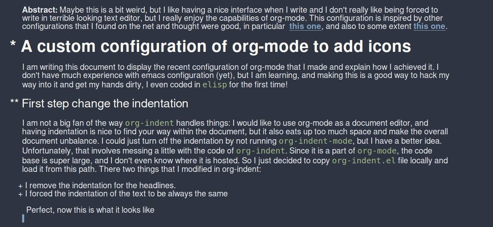
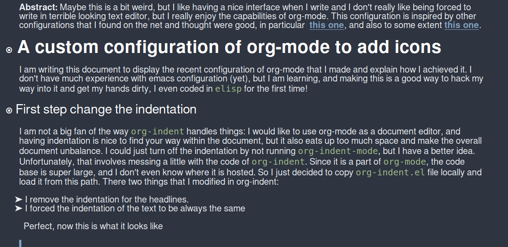
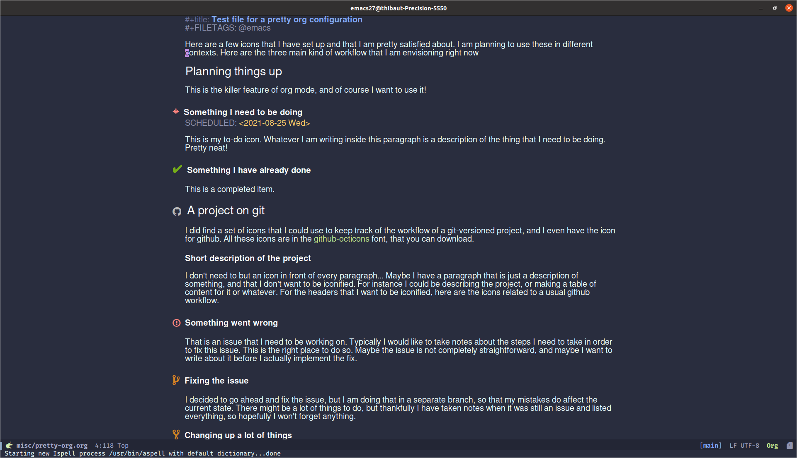
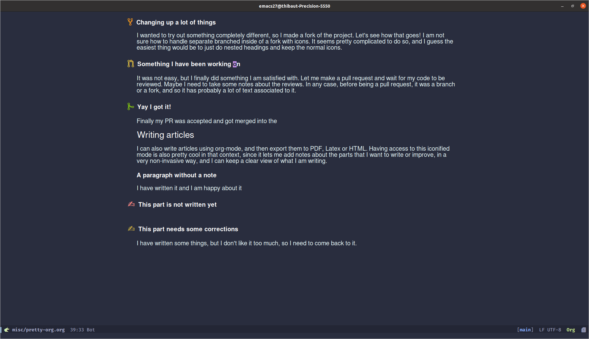

**Abstract:** Maybe this is a bit weird, but I like having a nice interface when I write and I don't really like being forced to write in terrible looking text editor, but I really enjoy the capabilities of org-mode. This configuration is inspired by other configurations that I found on the net and thought were good, in particular  [this one](https://www.reddit.com/r/emacs/comments/iemo44/wysiwygified_org_mode/), and also to some extent [this one](https://www.reddit.com/r/orgmode/comments/ikhjha/ricing_up_orgmode_completely_substitute_todo/).

# A custom configuration of org-mode to add icons

I am writing this document to display the recent configuration of org-mode that I made and explain how I achieved it. I don't have much experience with emacs configuration (yet), but I am learning, and making this is a good way to hack my way into it and get my hands dirty, I even coded in `elisp` for the first time!

## First step change the indentation

I am not a big fan of the way `org-indent` handles things: I would like to use org-mode as a document editor, and having indentation is nice to find your way within the document, but it also eats up too much space and make the overall document unbalance. I could just turn off the indentation by not running `org-indent-mode`, but I have a better idea. Unfortunately, that involves messing a little with the code of `org-indent`. Since it is a part of `org-mode`, the code base is super large, and I don't even know where it is hosted. So I just decided to copy `org-indent.el` file locally and load it from this path. There two things that I modified in org-indent:

1.  I remove the indentation for the headlines.
2.  I forced the indentation of the text to be always the same

Perfect, now this is what it looks like

I am pretty sure this is a very suboptimal way to do this. Feel free to get in touch if you know of any better solution!

## Configure org-superstar mode

Now that we have done this, I want to use the extra space that I have on the left to display some information nicely, in place of those annoying stars at the beginning of every heading. So we'll manage them using the `org-superstar` package. It is a nice package that allows you to configure how to display these stars, and it can handle the last star, which is displayed as a prettified bullet, and all the other stars, that can either be hidden, or prettified by a "leader" symbol. I want to get rid of the fact that there are multiple stars, and only keep the last star of each line, so I set the leader symbol to be the empty string, so that they completely disappear, and stop taking any space. Now we have a problem: things are not aligned since as the depth of the subheading increase, the size of the star shrinks. We can fix that by setting the face for the prettified bullet. We will chose a fixed-pitch face with a defined height, so that we are certain that all the heading are aligned again. Here is what this looks like now:

Not bad, but we can do better: Let's remove the bullets altogether now. To do this I will just replace the prettify symbols for the bullets by a blank space. However, I want to be sure that the alignment is kept straight, so let's use the unicode character U+2001, which is an em-quad space, that is a space of the same size as a character of the font. Now `org-superstar` has a really cool feature that allow us to display a special bullet for each of the todo-keywords. So we will use this to display which bullet, if any should be displayed instead of this space. This is not very difficult to set-up, just associate each to-do keyword with a symbol of your choice. Here is the code for that in my configuration. Don't worry if my choice of symbols seem a bit odd to you, it will all make sense soon.

    (use-package org-superstar
        :after org
        :hook (org-mode . org-superstar-mode)
        :config
          (set-face-attribute 'org-superstar-header-bullet nil :inherit 'fixed-pitched :height 180)
        :custom
        ;; set the leading bullet to be a space. For alignment purposes I use an em-quad space (U+2001)
        (org-superstar-headline-bullets-list '(" "))
        (org-superstar-todo-bullet-alist '(("DONE" . ?✔)
                                           ("TODO" . ?⌖)
                                           ("ISSUE" . ?)
                                           ("BRANCH" . ?)
                                           ("FORK" . ?)
                                           ("MR" . ?)
                                           ("MERGED" . ?)
                                           ("GITHUB" . ?A)
                                           ("WRITING" . ?✍)
                                           ("WRITE" . ?✍)
                                           ))
        (org-superstar-special-todo-items t)
        (org-superstar-leading-bullet "")
        )

## Hide the todo keyword

Since we are using the todo keywords to control which icon to set in the margin, it would be a bit annoying to have the keyword always written again next to the margin, so instead we will remove it by prettifying it as an empty space

    (defun tb/org-mode-setup ()
        ;; (org-indent-mode)
        (visual-line-mode 1)
        (setq prettify-symbols-unprettify-at-point 'right-edge)
        (push '("[ ]" .  "☐") prettify-symbols-alist)
        (push '("[X]" . "☑") prettify-symbols-alist)
        (push '("[-]" . "❍") prettify-symbols-alist)
        (push '("TODO" . "") prettify-symbols-alist)
        (push '("DONE" . "") prettify-symbols-alist)
        (push '("BRANCH" . "") prettify-symbols-alist)
        (push '("MR" . "") prettify-symbols-alist)
        (push '("MERGED" . "") prettify-symbols-alist)
        (push '("FORK" . "") prettify-symbols-alist)
        (push '("ISSUE" . "") prettify-symbols-alist)
        (push '("GITHUB" . "") prettify-symbols-alist)
        (push '("WRITING" . "") prettify-symbols-alist)
        (push '("WRITE" . "") prettify-symbols-alist)
        (prettify-symbols-mode))

## Add a face for the leading bullet

There is one last thing I wanted to add: I would like to customize the face of the special to-do bullet, to add colors and make things a bit more neat. Unfortunately, that's a feature that does not exist in `org-superstar`. Thankfully, `org-superstar` is just a single elisp file stored in a repo on github, so if it is not there, let's add it. So I forked the project and started working on it. Since I just wanted to add a small feature, it wasn't that big a deal, and now if you use my fork you can set a custom face for the bullet of each of the todo items. I made a pull-request on the original repo, so hopefully this feature will be in the main repo soon enough!

Where is what my config looks like with the modified repo:

    (defvar tb/org-todo-bullet-faces
        '(("TODO" . (:inherit base-todo-keyword-face :foreground "#FF8580"))
          ("ISSUE" . (:inherit base-todo-keyword-face :foreground "#FF8580"
                                :family "github-octicons" :height 160))
          ("BRANCH" . (:inherit base-todo-keyword-face :foreground "#D58422"
                                :family "github-octicons"))
          ("FORK" . (:inherit base-todo-keyword-face :foreground "#D58422"
                                :family "github-octicons"))
          ("MR" . (:inherit base-todo-keyword-face :foreground "#C7A941"
                            :family "github-octicons"))
          ("MERGED" . (:inherit base-todo-keyword-face :foreground "#75AD18"
                                :family "github-octicons"))
          ("GITHUB" . (:inherit base-todo-keyword-face :foreground "#BBBBBB"
                                :family "github-octicons" :height 160))
          ("DONE" . (:inherit base-todo-keyword-face :foreground "#75AD18"))
          ("IDEA" . (:inherit base-todo-keyword-face :foreground "#85AAFF"))
          ("WRITE" . (:inherit base-todo-keyword-face :foreground "#FF8580"))
          ("WRITING" . (:inherit base-todo-keyword-face :foreground "#C7A941"))
              ))

      (use-package org-superstar
      :straight '(org-superstar
                  :fork (:host github
                          :repo "thibautbenjamin/org-superstar-mode"))
      :after org
      :hook (org-mode . org-superstar-mode)
      :config
        (set-face-attribute 'org-superstar-header-bullet nil :inherit 'fixed-pitched :height 180)
      :custom
      ;; set the leading bullet to be a space. For alignment purposes I use an em-quad space (U+2001)
      (org-superstar-headline-bullets-list '(" "))
      (org-superstar-todo-bullet-alist '(("DONE" . ?✔)
                                         ("TODO" . ?⌖)
                                         ("ISSUE" . ?)
                                         ("BRANCH" . ?)
                                         ("FORK" . ?)
                                         ("MR" . ?)
                                         ("MERGED" . ?)
                                         ("GITHUB" . ?A)
                                         ("WRITING" . ?✍)
                                         ("WRITE" . ?✍)
                                         ))
      (org-superstar-special-todo-items t)
      (org-superstar-leading-bullet "")
      (org-superstar-todo-bullet-face-alist tb/org-todo-bullet-faces)
      )

So now maybe you understand my weird choice of bullet for some of the items: they are displayed with the font `github-octicons`, in which they correspond to actual symbols of github!

# Putting everything together

Not bad right?

# What's next?

There are actually a few things that I would like to tackle now.

1.   I think my hack through `org-indent` to make my custom indentation is a pretty bad idea, and I would like to understand how to implement in a more reliable/scalable way. I don't want to have to manually synchronize this file with the distributed version of `org-indent`, and I cannot really share this file either, as I just manually modified a few lines and did not really contribute to anything.
2.   The `prettify-symbols-mode` that I use to get rid of the to-do keywords is nice and all, but I would rather have the to-do keywords behave more like how it is with the `org-appear` package, where you can make the `#+title:` disappear, but it reappears whenever the cursor enters the line.
3.   Following the same ideas, I would like to prettify the property drawers, and also and the schedules/deadline keywords, in a way that they are hidden and only indicated by a visual clue (I am thinking of an horizontal line and a calendar icon), which get displayed whenever the cursor hits them.
4.   I have to figure out a good way to handle the inline to-dos that I have not dealt with for now.
5.   I would like to try porting the idea of using icons to the agenda: For now when I open the agenda, I see a mix of to-do keywords, and no keywords, due to the interaction between the agenda itself and the `prettify-symbols-mode`. I am hoping that there is a way to fix this.
